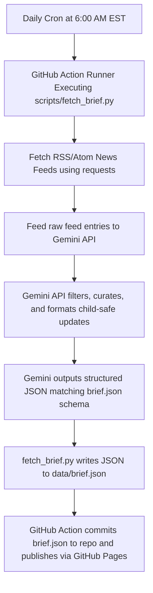

# DESIGN DISCUSSION: AI Pulse

This document outlines the architectural decisions, tech stack selections, planned library dependencies, and customization rules for **AI Pulse**.

---

## How We will Tailor it for Kids/Young Learners:
1. **Interactive UI**: The application will feature vibrant, bouncy transitions, playful emojis, and gamified playgrounds (like a cute grid world where they teach a robot 🤖 to find its battery 🔋 using Q-learning, or a neural network canvas where they add nodes and send glowing electric pulses ⚡).
2. **Balanced, Child-Safe Curation via Gemini**: We will program the Gemini LLM prompt to digest raw AI news and explain it in a supportive, exciting, and balanced tone suitable for a middle-school vocabulary—filtering out hyper-negative doom-mongering and presenting constructive, learning-focused narratives.
3. **EST Morning Cron**: The GitHub Actions scheduler is updated to run daily at 6:00 AM EST (`0 11 * * *` UTC) so the "Daily brief" is freshly baked and waiting when they wake up.

---

## 1. Tech Stack Selection & Alternatives Analysis

### Frontend: Vanilla HTML5, CSS3, and JavaScript (SPA)
Instead of adopting modern libraries like React/Vite or python libraries like Streamlit, we chose raw browser-native technologies.

#### Why not React or Next.js?
- **No Build Step Required**: Using plain HTML, CSS, and JS avoids configuration overhead (Webpack, Babel, Vite configs) and keeps the deployment footprint minimal.
- **Instant Browser Execution**: Direct execution is fast and easy to distribute, edit, and audit without complex dependency trees.
- **Portability**: The entire app compiles to three static files (`index.html`, `style.css`, `app.js`) that load instantly and perform at peak efficiency on any browser.

#### Why not Streamlit?
- **Aesthetics & Layout Control**: Streamlit has a highly opinionated, block-based UI template. Overriding it to support glassmorphism, animated glow highlights, and kid-friendly playful panels is extremely difficult and requires complex python-injected CSS strings.
- **Interactivity Latency**: Streamlit functions by executing the *entire* Python file on the server side every time a user drags a slider or clicks a button. For animations (e.g. rendering signal flows in neural networks or Q-value updates at 60fps), this server-side execution loop results in visual lag and stutter. Native JavaScript handles UI states instantly on the client side.
- **Host Costs**: Streamlit requires a persistent, active Python application server. In contrast, static HTML/CSS/JS files can be hosted for **100% free** on GitHub Pages.

---

## 2. Planned Libraries & Purpose

### Python Automation Backend (`dependencies` in `pyproject.toml`)

1. **`google-generativeai` (v0.5.0+)**
   - **Purpose**: Official SDK to interact with Google's Gemini models.
   - **Why this vs. others?**: Direct, first-class support for Gemini models. It provides the best latency, supports structured JSON outputs native to the API, and operates under Google's cost-efficient developer tiers.
   - **Alternative rejected**: `openai` (or other wrappers) because calling Gemini natively ensures we can utilize model features like structured schema validation directly.

2. **`requests` (v2.31.0+)**
   - **Purpose**: Fetch raw RSS, Google News RSS, or markdown articles from public feeds.
   - **Why this vs. others?**: It is the industry standard for HTTP requests in Python, featuring synchronous blocking calls that are easy to model, mock, and test.
   - **Alternative rejected**: `urllib.request` (built-in but verbose) and `httpx` (unnecessary complexity since asynchronous scraping isn't needed here).

### Development & Test Backend (`optional-dependencies.dev` in `pyproject.toml`)

1. **`pytest` (v7.0.0+)**
   - **Purpose**: Core testing framework.
   - **Why this vs. others?**: Streamlined boilerplate code compared to standard `unittest`. It has advanced fixture capabilities and clean output formatting.
   
2. **`pytest-mock` (v3.10.0+)**
   - **Purpose**: Mocking external services (the Gemini API and web fetch requests) during tests.
   - **Why this?**: Simplifies monkeypatch and mock objects, preventing our tests from executing real network requests or consuming Gemini API tokens during CI runs.

---

## 3. Curation Pipeline Architecture

This ensures a fully automated pipeline with **zero server costs**, **zero hosting costs**, and **instant, high-quality, balanced content updates** for young readers.
