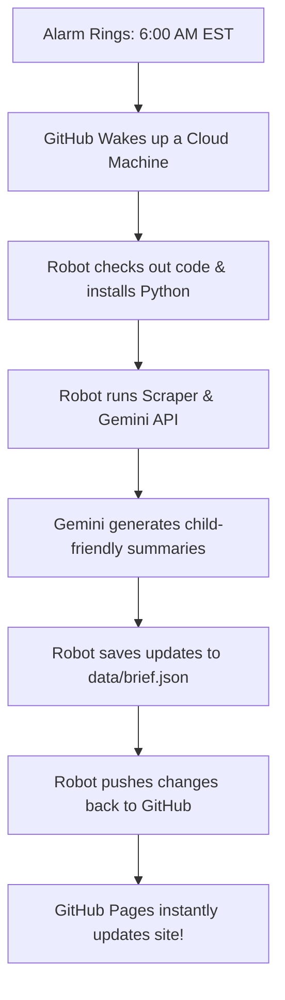

# 🤖 Serverless Daily Brief: Automation & Hosting Guide

Welcome to the engine room of **AI Pulse**! This document explains how we keep our daily AI updates running on 100% autopilot—without renting a server, writing database setups, or spending a single cent on hosting.

---

## 🎯 Our Goal & The Big Win

Traditional dashboards require renting a server (like AWS, Heroku, or a VPS) that runs 24/7 to fetch news, run APIs, and serve the web pages. This costs money ($5 to $50/month) and requires constant security updates.

For **AI Pulse**, we engineered a **Serverless & Static Architecture**.
* **💸 $0 Server Costs**: Our database is a plain file (`data/brief.json`), and our server is a free GitHub Actions runner.
* **⚡ 60fps Performance**: Browsers only load static HTML/CSS/JS files, which makes the app load instantly.
* **🔒 Bulletproof Security**: Since there is no database server or live backend, it is impossible for hackers to breach or crash our systems.

---

## 🛠️ The Tech Stack: GitHub's Free Superpowers

We use three core GitHub technologies to achieve this:

| Technology | What it is | How we use it |
| :--- | :--- | :--- |
| **GitHub** | A cloud vault for code and files. | Stores our frontend, Python scripts, test suites, and our daily news JSON database. |
| **GitHub Actions** | A cloud computer that wakes up on command. | Runs our python scraper, calls Gemini, compiles the updates, and saves it. |
| **GitHub Pages** | A free global web distributor (CDN). | Serves our website files to kids and learners worldwide with zero lag. |

---

## ⏰ The Daily Automation Schedule

Our GitHub Actions helper follows a precise routine:



### The Cron Trigger
In [.github/workflows/daily-brief.yml](file:///Users/harshvyas/Documents/ai-pulse/.github/workflows/daily-brief.yml), this is configured using standard cron scheduling:
```yaml
on:
  schedule:
    - cron: '0 11 * * *' # 11:00 AM UTC = 6:00 AM EST (or 7:00 AM EDT)
```

---

## 🚀 How to Run the Scraping Script Manually

If you don't want to wait until tomorrow morning to see new articles, you can force the robot to run immediately!

### Option A: From the GitHub Website (Recommended)
1. Go to your repository page on GitHub.
2. Click on the **Actions** tab at the top.
3. In the left sidebar, click on **Daily AI Brief Update**.
4. Look for the grey banner on the right and click **Run workflow** ▾.
5. Select the `main` branch and click the green **Run workflow** button.
6. The job will start running in 5 seconds. You can click on it to watch the logs!

### Option B: Local Command Line
You can also run the scraper directly on your machine:
```bash
# 1. Set your Gemini API key in your terminal session
export GEMINI_API_KEY="your_api_key_here"

# 2. Run the script
python scripts/fetch_brief.py
```
This will overwrite your local [data/brief.json](file:///Users/harshvyas/Documents/ai-pulse/data/brief.json) file immediately.

---

## 🔑 Security Setup: Keeping Secrets Secret

To fetch summaries, our Python script needs to talk to the Google Gemini API. Since we don't want anyone else stealing our API key, we use **GitHub Secrets**:

> [!WARNING]
> Never write your API Key directly inside scripts or commit it to GitHub. If you do, Google will deactivate it automatically for security.

### How to link your API key:
1. Go to your repository settings on GitHub.
2. Navigate to **Secrets and variables** ➔ **Actions**.
3. Click **New repository secret**.
4. Set the name to `GEMINI_API_KEY`.
5. Paste your Gemini API key into the value field and click **Add secret**.
6. The GitHub Actions robot can now access this secret safely behind the scenes!
