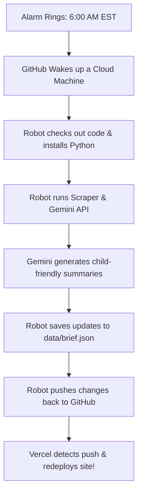

# 🤖 Serverless Daily Brief: Automation & Hosting Guide

Welcome to the engine room of **AI Pulse**! This document explains how we keep our daily AI updates running on 100% autopilot—without renting a server, writing database setups, or spending a single cent on hosting.

---

## 🎯 Our Goal & The Big Win

Traditional dashboards require renting a server (like AWS, Heroku, or a VPS) that runs 24/7 to fetch news, run APIs, and serve the web pages. This costs money ($5 to $50/month) and requires constant security updates.

For **AI Pulse**, we engineered a **Serverless & Static Architecture**.
* **💸 $0 Server Costs**: Our database is a plain file (`data/brief.json`), and our server is a free GitHub Actions runner.
* **⚡ 60fps Performance**: Browsers only load static HTML/CSS/JS files, which makes the app load instantly.
* **🔒 Bulletproof Security**: Since there is no database server or live backend, it is impossible for hackers to breach or crash our systems.

---

## 🛠️ The Tech Stack: Serverless Automation & Vercel Hosting

We use three core technologies to achieve this:

| Technology | What it is | How we use it |
| :--- | :--- | :--- |
| **GitHub** | A cloud vault for code and files. | Stores our frontend, Python scripts, test suites, and our daily news JSON database. |
| **GitHub Actions** | A cloud computer that wakes up on command. | Runs our python scraper, calls Gemini, curates the updates, and saves it to the repo. |
| **Vercel** | A premium static web host and cloud distributor. | Detects git pushes (from you or the action robot) and instantly redeploys the live site. |

---

## ⏰ The Daily Automation Schedule

Our GitHub Actions helper follows a precise routine:



### The Cron Trigger
In [.github/workflows/daily-brief.yml](file:///Users/harshvyas/Documents/ai-pulse/.github/workflows/daily-brief.yml), this is configured using standard cron scheduling:
```yaml
on:
  schedule:
    - cron: '0 11 * * *' # 11:00 AM UTC = 6:00 AM EST (or 7:00 AM EDT)
```

---

## 🚀 How to Run the Scraping Script Manually

If you don't want to wait until tomorrow morning to see new articles, you can force the robot to run immediately!

### Option A: From the GitHub Website (Recommended)
1. Go to your repository page on GitHub.
2. Click on the **Actions** tab at the top.
3. In the left sidebar, click on **Daily AI Brief Update**.
4. Look for the grey banner on the right and click **Run workflow** ▾.
5. Select the `main` branch and click the green **Run workflow** button.
6. The job will start running in 5 seconds. You can click on it to watch the logs!

### Option B: Local Command Line
You can also run the scraper directly on your machine:
```bash
# 1. Set your Gemini API key in your terminal session
export GEMINI_API_KEY="your_api_key_here"

# 2. Run the script
python scripts/fetch_brief.py
```
This will overwrite your local [data/brief.json](file:///Users/harshvyas/Documents/ai-pulse/data/brief.json) file immediately.

---

## 🔑 Required GitHub Configuration & Permissions

To make sure the daily cron successfully updates the site on Vercel, you need to configure two things in your GitHub repository settings:

### 1. Add Gemini API Key Secret
Our Python curation script needs to talk to the Google Gemini API. Since we don't want anyone else stealing our API key, we use **GitHub Secrets**:

> [!WARNING]
> Never write your API Key directly inside scripts or commit it to GitHub. If you do, Google will deactivate it automatically for security.

1. Go to your repository settings on GitHub.
2. Navigate to **Secrets and variables** ➔ **Actions**.
3. Click **New repository secret**.
4. Set the name to `GEMINI_API_KEY`.
5. Paste your Gemini API key into the value field and click **Add secret**.

### 2. Enable Workflow Write Permissions
By default, GitHub Actions runs with a read-only token and is blocked from pushing commits back to your repository. You must authorize it to commit the updated `data/brief.json`:

1. Go to your repository settings on GitHub.
2. Navigate to **Actions** ➔ **General** (under the "Security" section).
3. Scroll down to **Workflow permissions**.
4. Select **Read and write permissions** (this allows the action to commit and push changes back).
5. Click **Save**.

Once these two items are set, the workflow will push updates on autopilot, and Vercel will instantly redeploy them!

---

## 💡 Frequently Asked Questions (FAQ)

### 1. If I push my commits right now, will Vercel still deploy the website?
**Yes, absolutely.** Vercel only compiles and hosts the static code (HTML/CSS/JS) in your repository. It does not run the Python curation script during its build stage, meaning it does **not** need the Gemini API key or write permissions to serve your updated pages. Any layout or design changes you push will go live immediately.

### 2. When are the Gemini API Key and Write Permissions actually needed?
They are **only** required for the automated daily curation script running in GitHub Actions:
* **Gemini API Key**: Needed by `scripts/fetch_brief.py` on the Actions runner to query Gemini for fresh AI news.
* **Write Permissions**: Needed by the Actions runner to push the updated `data/brief.json` back to your GitHub repository.

If these are not configured, your code changes will still deploy to Vercel, but the daily brief content itself will remain static and will not update on autopilot.

### 3. How does Vercel know when a new commit is pushed? Does it poll GitHub?
No, Vercel does **not** poll GitHub. Instead, it uses a **Webhook (Push Model)**:
* **The Webhook Trigger**: When you connect your repository, Vercel registers a webhook with GitHub. The moment you run `git push`, GitHub immediately triggers an HTTP POST request to Vercel's API.
* **Ephemeral Build Environment**: Vercel spins up a temporary build container (similar to a containerized pod) to pull the fresh commit, compile files (if a compiler is used), and package the assets.
* **Global Edge Network (CDN)**: Once compiled, the static assets (`index.html`, `style.css`, etc.) are uploaded and cached on edge servers globally. There is no persistent pod or server running 24/7, which guarantees lightning-fast loading speeds and zero server costs.
